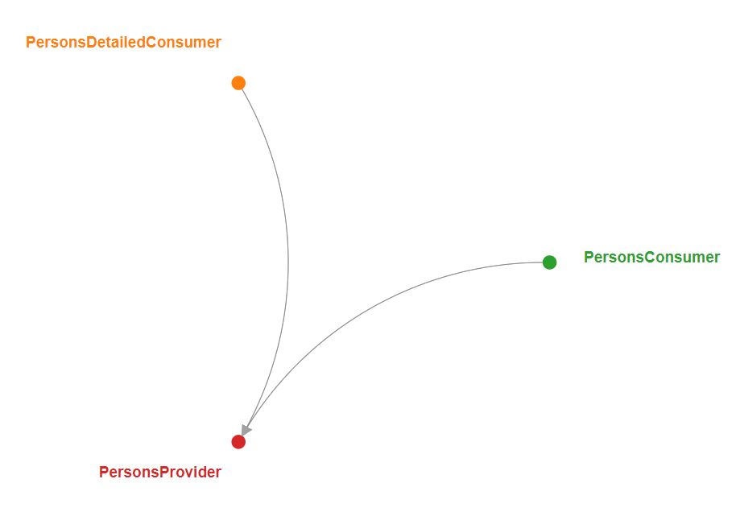

# CDC

Demonstrating CDC using Pact-JVM, Junit5, Spring Boot, and Pact broker

# Project Structure

In this example, the endpoints exposed by Provider (module) services are used by two different Services (modules),
consumer and consumer 2.

Also, using the docker-compose file we can set up a Pact broker. In the Pact broker dashboard we can see the network
graph of all the interactions between consumers and producers

